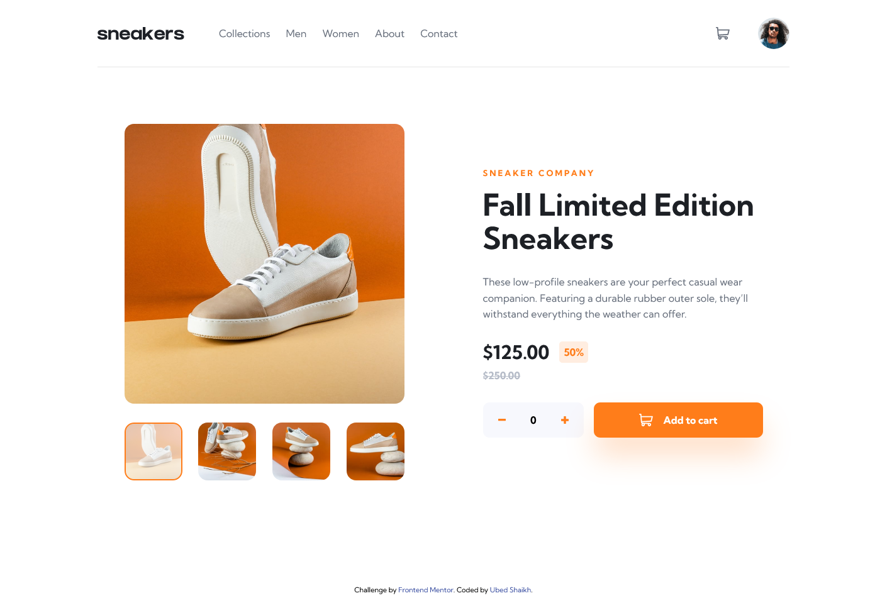

# Frontend Mentor - E-commerce product page solution

This is a solution to the [E-commerce product page challenge on Frontend Mentor](https://www.frontendmentor.io/challenges/ecommerce-product-page-UPsZ9MJp6). Frontend Mentor challenges help you improve your coding skills by building realistic projects.

## Table of contents

- [Overview](#overview)
  - [The challenge](#the-challenge)
  - [Screenshot](#screenshot)
  - [Links](#links)
- [My process](#my-process)
  - [Built with](#built-with)
  - [What I learned](#what-i-learned)

## Overview

### The challenge

Users should be able to:

- View the optimal layout for the site depending on their device's screen size
- See hover states for all interactive elements on the page
- Open a lightbox gallery by clicking on the large product image
- Switch the large product image by clicking on the small thumbnail images
- Add items to the cart
- View the cart and remove items from it

### Screenshot



### Links

- Solution URL: [CLICK HERE 🚀](https://github.com/ubed90/ecommerce-product-page-main)
- Live Site URL: [CLICK HERE 🚀](https://ubed90.github.io/ecommerce-product-page-main/)

## My process

### Built with

- Semantic HTML5 markup
- CSS custom properties
- Flexbox
- CSS Grid
- Mobile-first workflow

### What I learned

1. Got good command Over Absolute and Fixed Positioning.
2. Learned How to clone an element in javascript and reduce HTML code.
3. Learned to use Advanced FlexBox and CSS GRID
4. Learned How to make Gallery Carousel Using Vanilla JS.
5. Learned How to Fire Event on window Resiszing.

```js
window.addEventListener("resize", resizeImages);
```